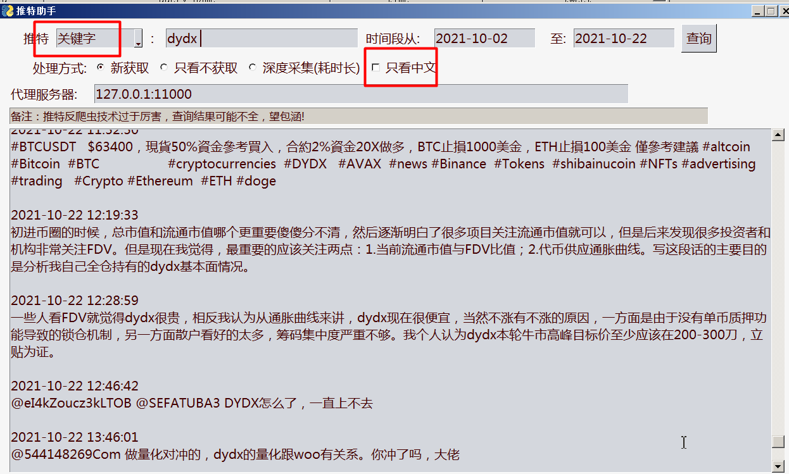
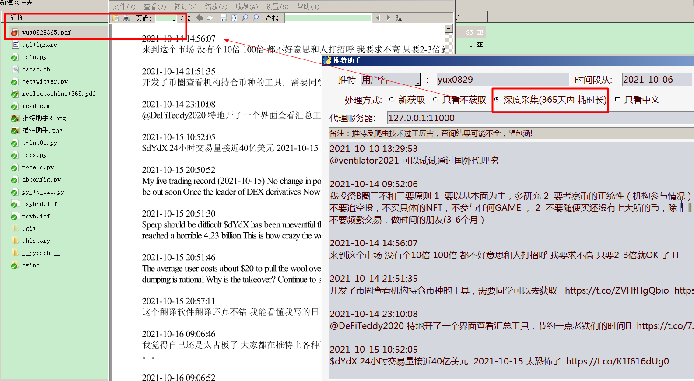

# 简要说明

## 开发目的

当你使用推特的时候，由于你订阅了很多用户，它是按时间线给你推送信息，而你想深度研究某个人的文字，最好按时间先后顺序查看，而不是倒序查看的时候，那么就可以使用这个工具了。

相信我，看了下面的截图，聪明的你就知道如何使用了。

深度采集功能还在开发中

v1.1 版本
增加
1. 可以根据关键字查询
2. 可以只看中文

如下图：

v1.3 版本

终于完成了深度采集功能，对单个用户采集365天的推特，在当前目录下保存为同名PDF文件
如下图：

v1.4 版本
exe文件太大，无法上传，采用这个命令生成
pyinstaller -F -w main.py --icon=TWITTER.png
